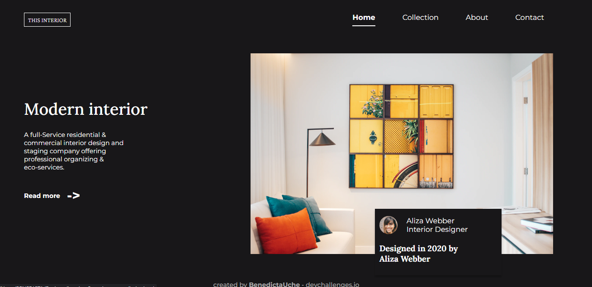

<!-- Please update value in the {}  -->

<h1 align="center">{Interior Consultant Page}</h1>

   Solution for a challenge from  <a href="http://devchallenges.io" target="_blank">Devchallenges.io</a>.

  <h3>
    <a href="https://venerable-jelly-617a07.netlify.app">
      Demo
    </a>
     | 
    <a href="https://github.com/BenedictaUche/Interior-Consultant-page.git">
      Solution
    </a>
     | 
    <a href="https://devchallenges.io/challenges/Jymh2b2FyebRTUljkNcb">
      Challenge
    </a>
  </h3>

<!-- TABLE OF CONTENTS -->

## Table of Contents

- [Overview](#overview)
  - [Built With](#HTML)
- [Features](#features)
- [Contact](mailto:benedictaonyebuchi@gmail.com)
- [Acknowledgements](#acknowledgements)

<!-- OVERVIEW -->

## Overview

Introduce your projects by taking a screenshot or a gif. Try to tell visitors a story about your project by answering:

- The demo can be found in my github account. The link is below
- Creting this page was quite fun

### Built With

HTML
CSS
JavaScript

## Features

<!-- List the features of your application or follow the template. Don't share the figma file here :) -->

This application/site was created as a submission to a [DevChallenges](https://devchallenges.io/challenges) challenge. The [challenge](https://devchallenges.io/challenges/Jymh2b2FyebRTUljkNcb) was to build an application to complete the given user stories.

## Contact

- GitHub [BenedictaUche](https://github.com/BenedictaUche)
- Twitter [Benedicta](https://{twitter.com/Benny_dicta1})
